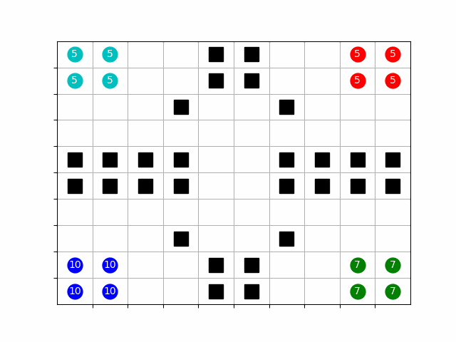

# ABMbattle

Agent Based Model of (Historical) Battle is simple tool allowing for simulations of combats using aganet approach.

## Goal 

The goal of this project is to create an Agent-Based model of battle, without using any specific modeling framework.\
The main requirement is scalability, developed software should allow the user to model any kind of simple battle scenario, giving flexibility when it comes to the number of armies, types of units and properties of the environment. 

## Structure

The project consists of the simulation core and many utilities and tools that allow for configuration and building of models. 

  **Engine** consist of Engine, BattleField and Unit classes. Instances of those last two represent independent agents and their environment. Engine class modifies their states during simulation by defined rules and used strategies.

  **Strategies** are classes that implement the make_move method. Whenever the Agent wants to perform the move, the engine passes the current state of the simulation and agent ID to the strategy that this agent implements. Based on this data decision which move, from possible, to choose.
  
  **Visualization** modules allow for creating graphical representations of simulated battles and latter saving them as GIFs.
  
  **Level Designer** is a tool for creating simulation scenarios and saving them to files. It is crucial as more complex simulations require a lot of time to model.

  **Configurations** are files and classes that allow storing, changing and remodeling created simulations. Same as level designer those are necessary for the robust workflow with simulations. 

## Examples

### 4 Teams Example - Detailed Viewer

### 3 Teams Example - Simple Viewer

### Simple Battle of Thermopylae

